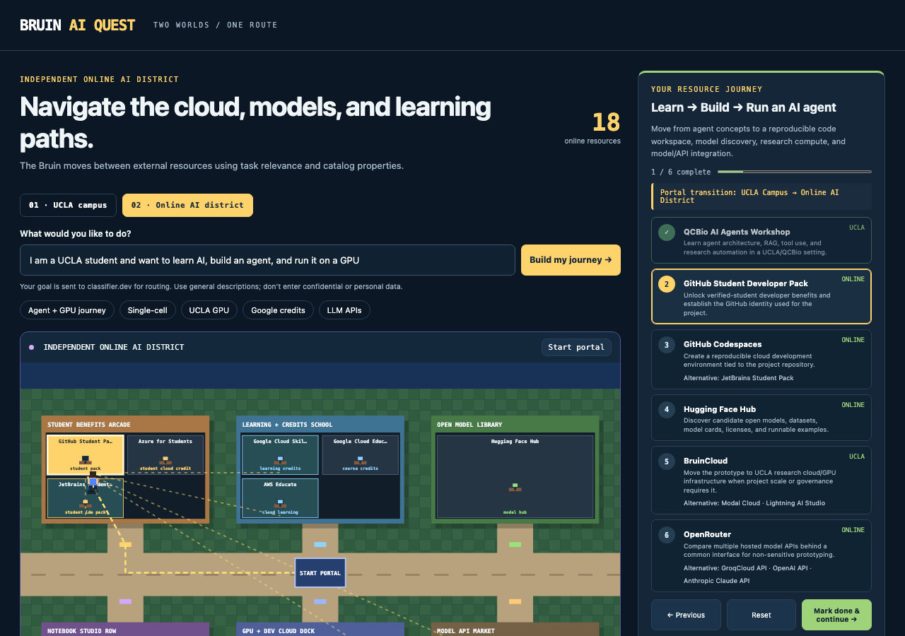

# Bruin AI Quest

**A community-built, Jev-powered journey planner for UCLA and independent AI resources.**

Bruin AI Quest turns AI discovery into two small pixel-art worlds. A student or researcher describes a goal, a fast typed decision model classifies the goal into a journey type, deterministic templates expand it into ordered milestones, and the Bruin avatar travels step-by-step across the appropriate worlds.

**UCLA Campus** uses real Westwood building and path geometry rendered in pixel art. Five workshops/events are placed at Boyer Hall, James West Alumni Center and Engineering V. UCLA-provided web services remain visibly identified as UCLA services without invented building locations. **Online AI World** is separate: it connects externally operated learning, cloud, model-gateway, fast-inference, and open-model resources through transparent next-step properties. See [campus locations, sources and map licensing](docs/CAMPUS_MAP.md) and [Online AI World](docs/ONLINE_AI_WORLD.md).

> Community-built open-source project. Not an official UCLA service or endorsement. Resource access, pricing, eligibility, and availability can change; always verify on the linked UCLA page.



## What it does

```text
student goal
    ↓
classifier.dev / Jev 1.13
    ↓
Choice: best immediate resource
Choice: journey archetype
Score: resource fit
Noul: likely needs human help?
    ↓
deterministic journey template
    ↓
ordered milestones + alternatives + actions
    ↓
UCLA Campus ↔ Online AI District
    ↓
Bruin travels step-by-step and progress is saved locally
```

The current catalog contains **17 UCLA/UCLA-affiliated resources and events plus 18 independent online resources**. External records are explicitly marked as provider-operated and retain their own source, access, billing, and data-boundary fields.

The model does not invent the sequence. Jev performs the fuzzy classification; deterministic code owns the ordered journey, prerequisites-by-order, alternatives, world transitions, progress state, and animation.

## UCLA resource facts used in v0.3

The registry was verified against UCLA pages on **2026-09-27**.

- Google Gemini for Education and Gemini Notebook are listed by UCLA DTS as available to active UCLA students, faculty, and staff at no additional cost.
- Microsoft Copilot is listed as available to active UCLA students, faculty, and staff at no additional licensing cost.
- UCLA DTS lists GitHub Copilot and AWS Kiro as **Coming Fall 2026**.
- Bruin AI Gateway is listed as **Coming Soon**.
- BruinCloud provides AWS/GCP infrastructure, model gardens, and scalable GPU/TPU resources for research use.
- QCBio offers an advanced AI Agents workshop covering LLMs, RAG, tool use, and task automation.
- UCLA AI Exchange includes student-focused AI programming such as GitHub Copilot and AWS sessions.

Source links are stored with every resource in `resources/ucla_ai_resources.json`.

## Online AI World

The separate online catalog in `resources/online_ai_resources.json` now contains **18 independent resources** arranged as a pixel-art AI district:

- **Student Benefits Arcade:** GitHub Student Developer Pack, Azure for Students, JetBrains Student Pack;
- **Learning + Credits School:** Google Cloud Skills, Google Cloud Education credits, AWS Educate;
- **Notebook Studio Row:** Google Colab, Kaggle Notebooks, Lightning AI Studio;
- **GPU + Dev Cloud Dock:** Modal and GitHub Codespaces;
- **Open Model Library:** Hugging Face Hub;
- **Model API Market:** OpenRouter, GroqCloud, Gemini API, Cloudflare Workers AI, OpenAI API, and Anthropic Claude API.

Each resource is a small shop/room rather than a floating graph node. Catalog `next_steps` still preserve the relevance network, and yellow connection beams show related services while the Bruin avatar walks through deterministic streets between shops. Credit, eligibility, billing, and data settings remain provider-specific and must be checked at use time.

## Quick start

```bash
git clone https://github.com/sureshpatel66/bruin-ai-quest.git
cd bruin-ai-quest
./run.sh
```

Then open:

```text
http://127.0.0.1:8790
```

The default backend is classifier.dev using `jev-latest`. A classifier.dev workspace key is optional for the public endpoint; if you have one:

```bash
export CLASSIFIER_API_KEY="..."
./run.sh
```

To use the deterministic fallback only:

```bash
BRUIN_BACKEND=rules ./run.sh
```

## Example missions

- "I want help reading and synthesizing research papers"
- "I want help writing Python and publishing a GitHub repository"
- "I need GPU compute for a large biomedical dataset"
- "I want to learn AI agents for bioinformatics research"
- "I want to compare AI models through one API endpoint"
- "I want UCLA AI workshops and student training events"

## Ordered journeys

v0.3 replaces the old "best resource + alternatives" view with eight ordered journey archetypes: AI-agent builder, single-cell research, coding project, GPU compute, literature review, model-API exploration, cloud learning, and general AI discovery.

For example:

```text
Example goal: "A UCLA student wants to learn AI,
build an agent, and run it on a GPU."

QCBio AI Agents
    ↓
GitHub Student Developer Pack
    ↓
GitHub Codespaces
    ↓
Hugging Face Hub
    ↓
BruinCloud
    ↓
OpenRouter
```

Each step exposes its purpose, a concrete milestone action, current access/status, official source, and alternatives where appropriate. Campus ↔ online transitions are explicit. Completion state is stored only in the user's browser via `localStorage`; it is not persisted on the server. See [journey architecture](docs/JOURNEYS.md).

## Architecture

```text
resource registries + journey templates
               │
               ▼
        student goal + profile
               │
               ▼
      decision backend
       ├── classifier.dev / Jev
       └── deterministic rules fallback
               │
               ▼
  resource choice + journey archetype
               │
               ▼
 deterministic journey expansion
               │
               ▼
 ordered milestones / alternatives / actions
               │
               ▼
 UCLA campus map ↔ online AI district
               │
               ▼
 browser-local progress + deterministic movement
```

Jev owns fuzzy classification only. Deterministic code owns the scientific/resource sequence, exact progress state, world transitions, pathfinding, rendering, and resource metadata.


## Privacy and security

The hosted API accepts only a `goal` string of at most 2,000 characters. Arbitrary profile dictionaries, files, credentials, and legacy routing endpoints are not exposed publicly. Raw goals are not written to server-side log files by the application.

When the classifier backend is available, the goal is sent to classifier.dev for typed routing. Use general descriptions only; do not submit confidential, personally identifying, regulated, or restricted research information. Journey completion state is stored only in the browser with `localStorage`.

Production adds best-effort per-client/per-instance rate limiting, disables public FastAPI docs/OpenAPI endpoints, sends `Cache-Control: no-store` on API responses, and applies a restrictive browser security-header policy. A deployment-side classifier API key is ignored unless `BRUIN_USE_CLASSIFIER_KEY=1` is explicitly enabled. See [SECURITY.md](SECURITY.md) for vulnerability reporting.

## Public-repo safety

Do not add credentials, personal data, restricted or unpublished research data, internal institutional information, or collaborator-only material. Example missions should use synthetic, public, or clearly shareable data.

## Current source pages

- UCLA DTS AI Tools: https://dts.ucla.edu/products-services/ai-tools
- UCLA Google AI: https://www.dts.ucla.edu/products-services/ai-tools/google-ai
- UCLA Microsoft AI: https://dts.ucla.edu/products-services/ai-tools/microsoft-ai
- UCLA OpenAI: https://www.dts.ucla.edu/products-services/ai-tools/open-ai
- UCLA AI Exchange: https://dts.ucla.edu/initiatives/ai/ucla-ai-exchange
- QCBio AI Agents workshop: https://qcb.ucla.edu/collaboratory/workshops/w19-ai-agents/

## Next milestones

1. Add structured journey filters for student eligibility, free/paid access, compute type, and data sensitivity.
2. Add prerequisite gates and branch logic so journeys adapt when a resource is unavailable or the user already completed a step.
3. Add live UCLA event freshness checks without silently changing curated records.
4. Add optional `Jev vs Kev-4B vs rules` journey-classification comparison and benchmark cards.
5. Add biomedical research journeys using only public or synthetic data.
6. Add a public feedback/correction workflow for stale resource records.

## License

MIT for the project code. Verify licensing separately for any third-party art assets you add later.

The campus geometry database in `web/assets/campus-map.json` is derived from OpenStreetMap and distributed under ODbL 1.0, © OpenStreetMap contributors. It is not covered by the MIT code license. Official UCLA map artwork is linked, not redistributed.

## Deploy to Vercel

The repository includes `api/index.py` and `vercel.json` for Vercel. The Python API is packaged as a Vercel Function and the root/static paths are rewritten to the FastAPI app.

```bash
vercel deploy --prod
```

The app does not require a classifier.dev key for the public endpoint. If a workspace key is configured, add it only in the deployment environment. Production ignores the key unless `BRUIN_USE_CLASSIFIER_KEY=1` is also set, which prevents accidental billable-key use.
